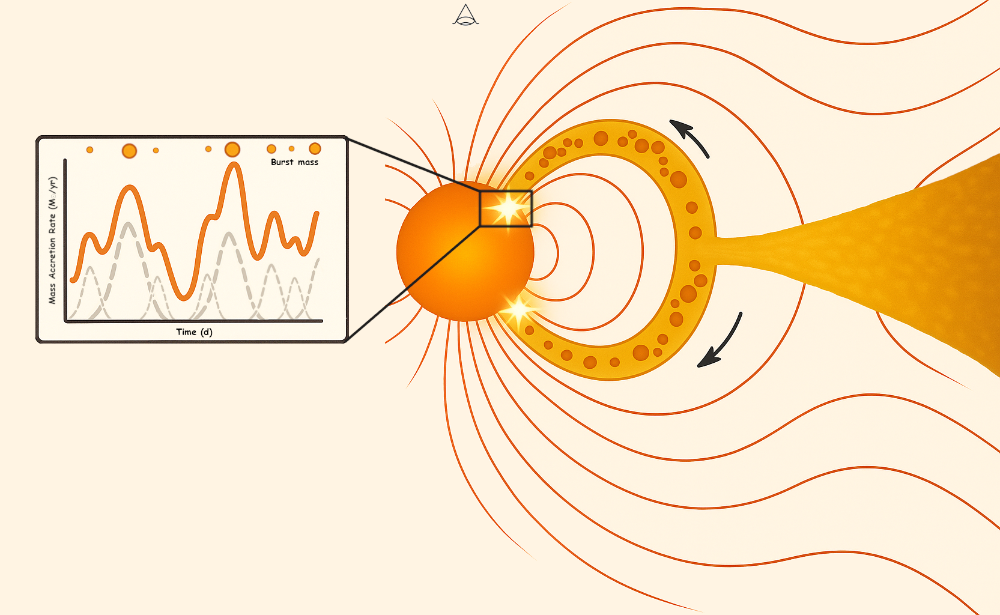

# Clumpy Accretion Toy Model

This repository contains a simple Python implementation of a *clumpy accretion* model designed to simulate the time-variable mass accretion rate onto a Classical T Tauri Star (CTTS). The model assumes that accretion occurs in discrete bursts associated with the stochastic infall of clumps of gas along magnetospheric field lines.

The resulting light curve is constructed by superimposing Gaussian-shaped bursts, each corresponding to an individual clump.



> *Illustration: Magnetospheric accretion from a protoplanetary disk with bursts modeled as Gaussian events, where the amplitude and width depend on the clump mass and time.*

This toy model was inspired by the ongoing work of **Tao Ji** and **Greg Herczeg**, who are developing observational and theoretical tools to understand burst-dominated accretion in TW Hya. The approach here allows others to generate synthetic light curves with physically motivated burst properties, suitable for testing fitting strategies or comparing with TESS/ground-based data.

## How to Use

Make sure you have Python 3 installed along with NumPy and Matplotlib:

```bash
pip install numpy matplotlib
```

Then, you can generate a synthetic clumpy accretion light curve with:

```python
from clumpy_toy_model import run_clumpy_model, G, M_star, R_star
import numpy as np

result = run_clumpy_model(
    alpha=-1.2,
    mu_log=np.log(1.5),
    sigma_log=1,
    rho=0.98,
    total_days=25,
    cadence_min=2
)

# Extract components
t = result['time_days']
Lacc = result['lc_model']            # Accretion luminosity (erg/s)
masses = result['masses']           # Clump masses (Msun)
durations = result['durations']     # Clump durations (days)
t0 = result['t0_days']              # Clump peak times (days)

# Convert luminosity to mass accretion rate (in Msun/yr)
Mdot = Lacc * R_star / (G * M_star) * (365.25 * 24 * 3600)  # from g/s to Msun/yr
```

### Plotting Light Curve

```python
import matplotlib.pyplot as plt

plt.plot(t, Mdot)
plt.xlabel("Time (days)")
plt.ylabel("Mass Accretion Rate (M$_\\odot$/yr)")
plt.title("Synthetic Clumpy Accretion Light Curve")
plt.show()
```

### Clump Property Distributions

```python
fig, axs = plt.subplots(1, 4, figsize=(21, 5))

axs[0].hist(t0, bins=15, color='skyblue', edgecolor='black')
axs[0].set_xlabel('Burst Time (days)')
axs[0].set_ylabel('Number of Bursts')
axs[0].set_title('Distribution of Burst Times')

axs[1].hist(masses, bins=np.logspace(np.log10(min(masses)), np.log10(max(masses)), 12),
            density=True, color='salmon', edgecolor='black')
axs[1].set_xscale('log')
axs[1].set_xlabel(r'Clump Mass ($M_\odot$)')
axs[1].set_ylabel(r'Density (1/$M_\odot$)')
axs[1].set_title('Distribution of Clump Masses')

axs[2].hist(durations, bins=np.logspace(np.log10(min(durations)), np.log10(max(durations)), 12),
            density=True, color='mediumseagreen', edgecolor='black')
axs[2].set_xscale('log')
axs[2].set_xlabel('Burst Duration (days)')
axs[2].set_ylabel('Density (1/d)')
axs[2].set_title('Distribution of Burst Durations')

axs[3].scatter(masses, durations, color='darkorange', edgecolors='black', alpha=0.7)
axs[3].set_xscale('log')
axs[3].set_yscale('log')
axs[3].set_xlabel(r'Clump Mass ($M_\odot$)')
axs[3].set_ylabel('Burst Duration (days)')
axs[3].set_title('Clump Mass vs Burst Duration')
axs[3].grid(True, which="both", ls="--", linewidth=0.5)

plt.tight_layout()
plt.show()
```

## Output

The `run_clumpy_model()` function returns a dictionary with:
- `time_days`: Time array.
- `lc_model`: Accretion luminosity (erg/s).
- `masses`: Clump masses (in M$_\odot$).
- `durations`: Duration of each burst (in days).
- `t0_days`: Time of each burst's peak (in days).

## Credits

This model is for exploratory and illustrative purposes only. It was inspired by the theoretical and observational framework developed by Tao Ji and Greg Herczeg.
